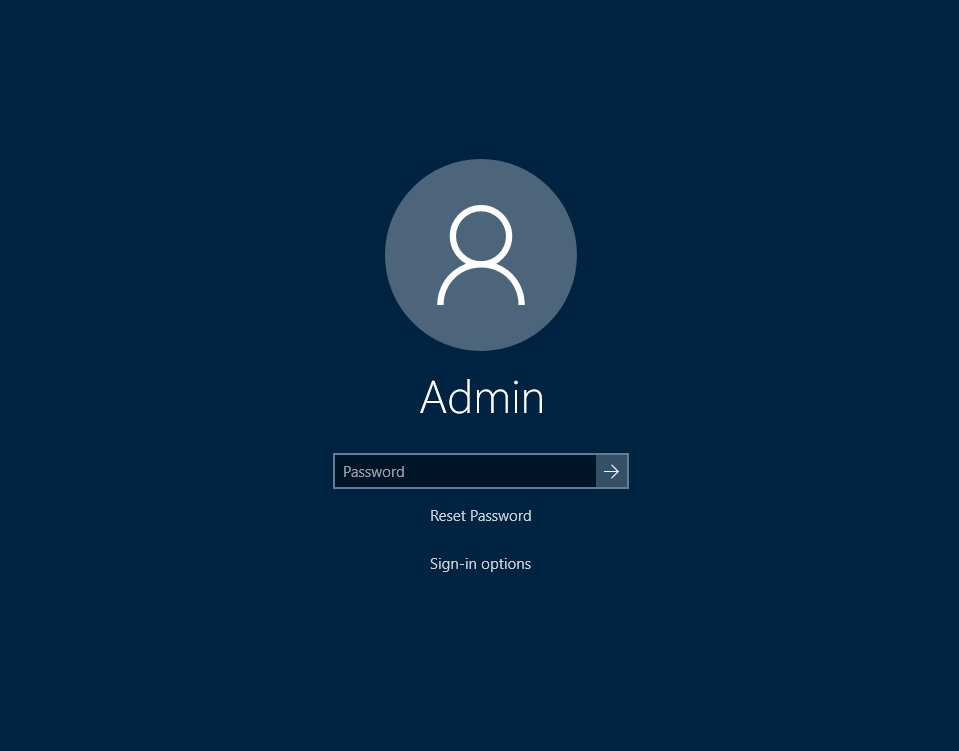

# Windows Credential Provider

This project looks to open the oportunity to easily create Windows credential providers for Windows 7, 8 and 10 using managed .NET. Credential providers are COM based, with the interfaces needed for Windows credential providers being written in C++. In .NET, it is possible to do COM interopability and platform invocation, making it possible to make a Windows credential provider in .NET.

Nonetheless, even when using COM interopability and platform invocation, the .NET equivalent interfaces created aren't very friendly for a managed language. This project builds on this by creating an object-oriented and functional API.

## Features

This library fully supports the `ICredentialProvider` interface as part of the Win32 API from the Microsoft documentation, including:

- Supports all usage scenarios of credential providers, including logon, change password, credentials UI dialog and pre-logon access.
- All controls are available including textboxes, checkboxes and links, with the ability to manipulate the data within these controls accordingly.
- Credential providers enumerating single tiles and multiple credential tiles, with different data in each credential tile.
- Extended credential tiles which have different behaviour in Windows 8 and 10 than in Windows 7.
- Connectable credential providers, used for any credential provider that wants to connect to a network, with additional UI processing.
- Fully supports wrapping existing credential providers, including built-in Windows credential providers.

## Getting Started

Getting started with this library is easy - simply install the package from the NuGet package manager.

### Installation

This library can be installed either by compiling the source yourself or by installing the NuGet package:

`Install-Package Windows-Credential-Provider`

### Basic Implementation

 

## Screenshots

The following screenshots are examples of credential providers included within this project, used in a variety of different scenarios.

### Wrap Credential Provider

This screenshot wraps the existing Windows password credential provider, and adds a link labelled 'Reset Password', enabling the user to reset their password. Note: this functionality is not included.

## License Information

Currently not licensable.
